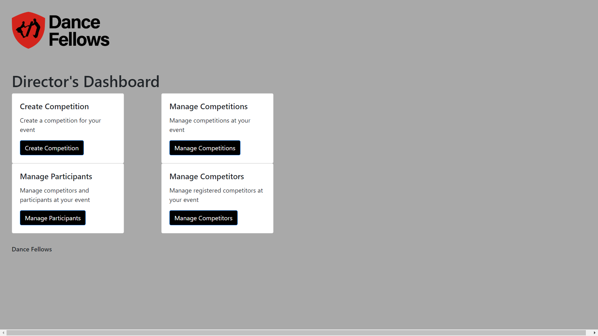
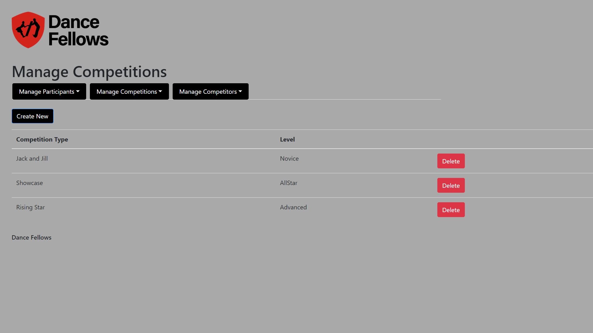
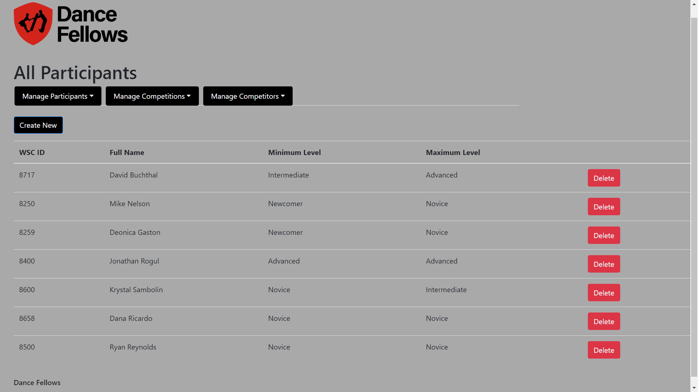
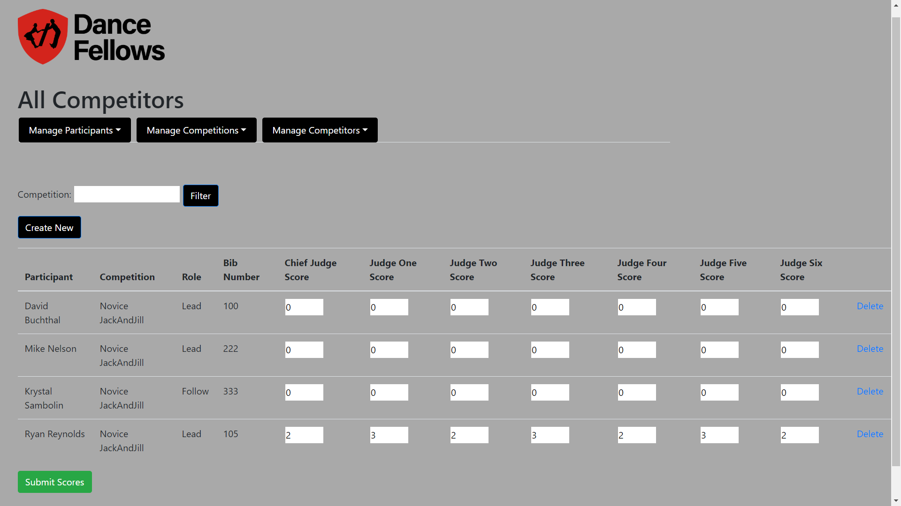
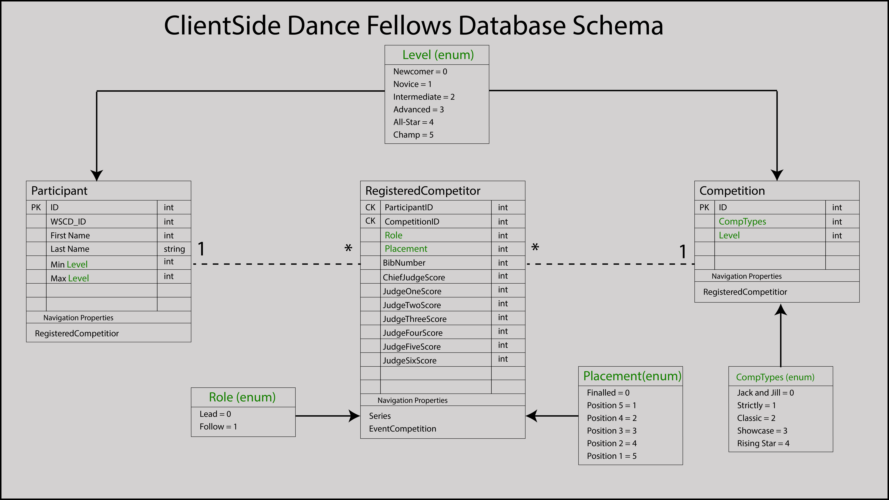
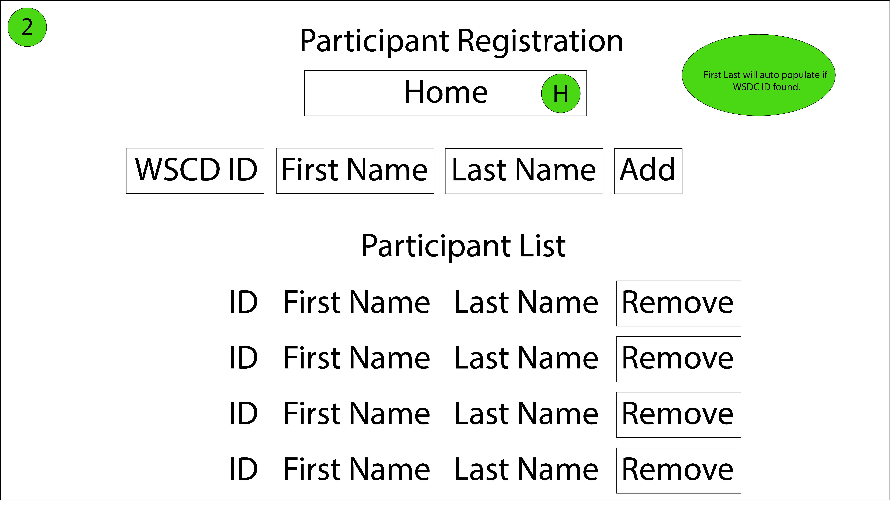

# Dance Fellows (Client Side)

## Overview
This application provides an Event Director with direct management capabilities for an entire Dance Event. This include the creation of participants, competitions as well as event registration.

### Deployed Site
https://dancefellows.azurewebsites.net/

## Example Usage

## User Stories

### User Story 1
As an event coordinator, I want to be able to set up and delete the competitions taking place at my event 
#### Features
* Event coordinator can select competitions (Jack & Jill, Classic, etc) to take place at the event
* Event coordinator can select the level (Newcomer, Novice, Intermediate, etc) of the competition 
#### Acceptance Criteria
* Create Competition view will have selection lists for competitions and level
* Create Competition view will allow multiple competitions per event
* Create Competition view will allow event coordinator to delete competitions from the event
* Only one competition/level combination will be allowed per event
* Competitions will be stored in client-side database

### User Story 2
As an event director, I want to be able to register both new participants and participants that have competed in previous events for my event as well as remove previously registered participants.
#### Features 
* Director can register a new participant for their event on a page on the full-stack application.
* Director  can register a competitor from a previous event on that same page on the application.
* Director can remove the registration of a previously registered participant on the same page of the application.
* Director cannot reregister a competitor without removing the previous registration for the event.
#### Acceptance Criteria
* Ensure that when a director registers a new participant, a record in the participants table is created and populated with a first name and a last name.
* Ensure that when a director registers a new participant, a record in the participants table is created with a null value for the WSDC ID.
* Ensure that when a director registers a new participant, a record in the participants table is created with a null value for both the minimum competition level and maximum competition level.
* Ensure that when a director registers a previously existing participant, a record in the participants table is created and populated with a first name, last name, WSDC ID, minimum competition level, and maximum competition level.
* Ensure that if a director attempts to register a participant that matches an existing participant's first name, last name, and non-null WSDC ID, the registration is rejected.

### User Story 3
As an event director, I want to be able to register the participants at my event into the appropriate competition
#### Features
* Event director will enter competitors WSDC ID number to populate the competitors name and competition level
* Event director can assign competitors to competitions
* Event director can enter competitors bib number
#### Acceptance Criteria
* WSDC ID will pull competitor information from the API database
* If competitor's level allows, user will be able to assign competitor to competitions
* Competitor assignments and bib numbers will be stored in client-side database

### User Story 4
As an event director, I want to be able to allow judges for a competition to enter values into a scoring sheet in order to allow competitors to be judged and ranked.
#### Features 
* Judges can access a page that allows them to pick between competitions in an event. 
* When a competition is selected, a table is generated with all competitors for the competition in the first column and entries for a judge's score in all other columns.
* Once a judge has filled in scores for all competitors (a column has been completely filled), the scores may be submitted by hitting a button at the bottom of the table.
#### Acceptance
* Ensure that scores assigned to a given competitor successfully save into database.
* Ensure that if a null score is to be saved into the database, the save action is rejected. 

### User Story 5
As an event director, I want all data entered into my website to be persisted.
#### Features
* The full-stack application shall have a database associated with it to persist data.
* The database shall contain tables for competitions, participants, and competitor registrations.
#### Acceptance Criteria
* Each model class has an associated table.
* Each table contains columns for each property reflected in its associated model class.
* Each table will be used to populate at least one view on the front end.

## Database Schema

## Wireframe

## Credit
Dance Fellows has been a collaborative effort by:
  Andrew Quamme https://github.com/andrewquamme  
  Blaise Clark https://github.com/Dervival  
  Jason Hiskey https://github.com/jlhiskey  
  Gwen Zubatch https://github.com/GwennyB  

This site was designed for use with the Dance Fellows API:  
https://github.com/GwennyB/DanceFellows-API/blob/master/README.md
